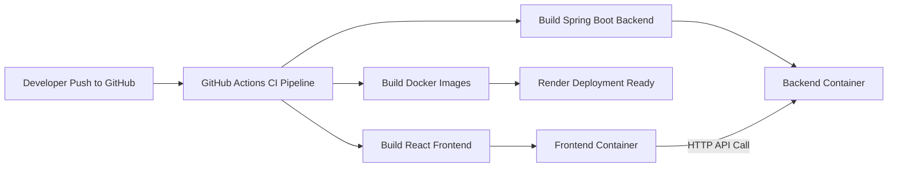

# Full Stack CI/CD Application - Project Report

## 1. Title Page

**Project Title:** Full Stack CI/CD Application (React + Spring Boot + Docker + GitHub Actions)

**Prepared By:** [Your Name / Team Name]

**Department / Institution:** [Department Name, College Name]

**Course / Subject:** [Course Name]

**Faculty Guide:** [Guide Name]

**Submission Date:** 08 April 2026

---

## 2. Certificate / Declaration (Optional Format)

This is to certify that the project titled **"Full Stack CI/CD Application"** is a bona fide work carried out by **[Student Name(s)]** under the guidance of **[Guide Name]** during the academic year **[Year]**.

---

## 3. Acknowledgment

We express our sincere gratitude to our faculty mentor, department, and institution for continuous support and guidance throughout this project. We also acknowledge the open-source communities of React, Spring Boot, Docker, and GitHub for providing the tools and documentation that made this implementation possible.

---

## 4. Abstract

This project presents a lightweight full stack web application integrated with a modern Continuous Integration/Continuous Deployment (CI/CD) workflow. The system uses **React (frontend)** and **Spring Boot (backend)**, containerized through **Docker**, and validated through **GitHub Actions** pipeline automation. The backend exposes a REST endpoint (`/api/hello`) and the frontend consumes this API to display real-time server response and connectivity state.

The solution demonstrates core DevOps practices: automated build and test execution, container-based consistency across environments, and cloud deployment readiness through Render configuration. The objective is to reduce manual deployment effort, improve release confidence, and establish a reproducible delivery pipeline suitable for academic and starter production scenarios.

---

## 5. Keywords

Full Stack Development, CI/CD, DevOps, React, Spring Boot, Docker, GitHub Actions, Render, Containerization, Web API.

---

## 6. Table of Contents

1. Title Page  
2. Certificate / Declaration  
3. Acknowledgment  
4. Abstract  
5. Keywords  
6. Introduction  
7. Problem Statement  
8. Objectives  
9. Scope  
10. Literature Review  
11. System Analysis and Requirements  
12. System Design and Architecture  
13. Implementation Details  
14. CI/CD Pipeline Design  
15. Testing and Validation  
16. Results and Discussion  
17. Limitations  
18. Future Enhancements  
19. Conclusion  
20. References  
21. Appendix (Screenshots / Commands)

---

## 7. Introduction

In software engineering, frequent releases and consistent build quality are major challenges in traditional development workflows. Manual integration and deployment often lead to environment mismatch, delayed feedback, and avoidable production errors.

This project addresses these issues by combining full stack development with CI/CD automation. The frontend is developed using React and built using Vite. The backend uses Spring Boot with Java 21 to expose REST endpoints. Docker is used to package both services in isolated containers, while GitHub Actions automatically builds and validates code on key repository events.

The project acts as a practical demonstration of how modern development teams can move from code commit to deployable artifact with minimal manual effort.

---

## 8. Problem Statement

Many student and early-stage projects are functionally correct but lack professional delivery practices. Common gaps include:

- No automated build pipeline
- Inconsistent local and deployment environments
- Manual deployment steps prone to error
- Limited confidence in code quality before release

This project aims to build a minimal but complete full stack solution with integrated CI/CD to solve these issues.

---

## 9. Objectives

- Develop a full stack web application using React and Spring Boot.
- Expose and consume REST APIs between frontend and backend.
- Containerize both services using Docker for reproducibility.
- Automate build and validation using GitHub Actions.
- Prepare deployment-ready configuration for cloud hosting (Render).
- Demonstrate standard DevOps workflow in an educational project.

---

## 10. Scope

### In Scope

- Frontend-backend communication using HTTP
- Build automation for Java and Node.js projects
- Docker image generation for both services
- Multi-service local orchestration using Docker Compose
- Deployment configuration for Render cloud platform

### Out of Scope

- Authentication and authorization
- Persistent database integration
- Advanced observability (centralized logs/metrics)
- Blue-green or canary production deployment

---

## 11. Literature Review

### 11.1 Full Stack Web Development

Full stack architecture separates user interface concerns from business logic and backend services. React is widely adopted for component-based UI and efficient rendering. Spring Boot simplifies enterprise-grade backend development by providing opinionated defaults for API creation and dependency management.

### 11.2 Continuous Integration and Continuous Delivery

CI is the practice of automatically integrating code changes and running validation checks. CD extends this by preparing or automating release deployment. Research and industry reports consistently indicate that CI/CD reduces integration defects, decreases lead time, and improves deployment reliability.

### 11.3 Containerization with Docker

Docker provides process-level isolation through containers, ensuring consistent runtime behavior across developer machines and cloud platforms. Multi-stage Docker builds reduce image size and separate build-time dependencies from runtime images.

### 11.4 Cloud Deployment for Modern Applications

Platform-as-a-Service offerings like Render simplify deployment by integrating source control triggers, managed runtime orchestration, and environment variable management. This supports smaller teams with limited infrastructure resources.

### 11.5 Related Tools and Practices

- GitHub Actions for event-driven CI pipelines.
- Maven for Java dependency and build lifecycle management.
- npm/Vite for frontend bundling and optimized production builds.
- Docker Compose for multi-container local execution.

### 11.6 Gap Identified

Many tutorials discuss each tool independently, but fewer beginner projects present an end-to-end path from source code to containerized CI-validated deployment. This project bridges that gap with an integrated implementation.

---

## 12. System Analysis and Requirements

### 12.1 Functional Requirements

- Backend should expose a REST endpoint at `/api/hello`.
- Frontend should fetch backend response and display status.
- UI should show loading, success, and error states.
- CI pipeline should build backend and frontend automatically.
- Docker setup should run both services through Compose.

### 12.2 Non-Functional Requirements

- Build reproducibility across environments.
- Fast feedback for code integration.
- Simple deployment configuration for cloud hosting.
- Maintainable codebase with clear structure.

### 12.3 Software Requirements

- Java 21
- Maven Wrapper
- Node.js 20+
- npm
- Docker and Docker Compose
- Git and GitHub repository

---

## 13. System Design and Architecture

### 13.1 High-Level Architecture

- **Frontend (React + Vite):** Handles user interface and API invocation.
- **Backend (Spring Boot):** Provides REST API endpoint.
- **CI/CD (GitHub Actions):** Validates build and integration pipeline.
- **Container Runtime (Docker):** Packages and runs services.
- **Cloud Deployment (Render):** Deployment target with environment configuration.

### 13.2 Architecture Flow (Mermaid)



### 13.3 Sequence Flow

1. User opens frontend application.
2. React app triggers API call to backend endpoint.
3. Backend returns plain text response.
4. Frontend displays response and connection status.

---

## 14. Implementation Details

### 14.1 Backend Implementation

- Framework: Spring Boot 3.4.1
- Language: Java 21
- Main endpoint: `GET /api/hello`
- CORS enabled with wildcard origin for cross-domain development setup.
- Test scaffold available via `contextLoads()` in Spring Boot test class.

### 14.2 Frontend Implementation

- Framework: React (Vite build system)
- API integration via `fetch` in `services/api.js`
- Environment-based API base URL using `VITE_API_URL` fallback to localhost
- UI state handling:
  - `loading`
  - `success`
  - `error`
- Manual refresh action through "Ping Backend" button

### 14.3 Dockerization

- Backend Dockerfile uses multi-stage build with Maven and Temurin JDK.
- Frontend Dockerfile uses Node build stage and Nginx production stage.
- `docker-compose.yml` orchestrates frontend and backend services with port mappings.

---

## 15. CI/CD Pipeline Design

Pipeline source: `.github/workflows/ci.yml`

### 15.1 Trigger Conditions

- Push on `dev` and `main`
- Pull request targeting `main`
- Manual dispatch

### 15.2 Pipeline Steps

1. Checkout repository source
2. Setup Java 21 and Maven cache
3. Build backend using Maven wrapper
4. Setup Node 20 and npm cache
5. Install frontend dependencies (`npm ci`)
6. Build frontend production bundle
7. Build Docker images using Compose

### 15.3 Expected Outcome

Every integration event produces a validated, buildable, container-ready codebase with reduced risk of environment-specific failures.

---

## 16. Testing and Validation

### 16.1 Backend Testing

- Basic Spring context load test confirms application startup viability.
- Endpoint-level manual validation can be performed using browser/Postman/curl on `/api/hello`.

### 16.2 Frontend Testing

- API call behavior validated through UI status updates:
  - Loading indicator while waiting
  - Success message when backend responds
  - Error message on backend unavailability

### 16.3 CI Validation

- Successful GitHub Actions run indicates both modules build correctly.
- Docker image build step verifies containerization integrity.

---

## 17. Results and Discussion

### 17.1 Achievements

- Functional full stack communication established.
- CI pipeline successfully automates build tasks for both modules.
- Containerized setup supports predictable local and cloud execution.
- Render deployment manifest prepared with service separation and API URL configuration.

### 17.2 Observations

- Even a minimal endpoint is sufficient to validate end-to-end integration.
- Automated pipeline catches integration breakages early.
- Container build checks in CI improve deployment confidence.

---

## 18. Limitations

- Current backend provides only a demo endpoint (no business domain logic).
- No user authentication or access control.
- No database or persistent storage layer.
- Limited automated test coverage beyond context startup and build validation.
- No monitoring, logging dashboard, or alerting stack.

---

## 19. Future Enhancements

- Add domain-specific APIs with CRUD operations.
- Integrate PostgreSQL/MySQL and JPA for persistence.
- Implement JWT-based authentication and role-based authorization.
- Add comprehensive unit and integration tests for frontend and backend.
- Add static code quality gates (lint + security scan + dependency audit).
- Introduce CD automation for staging/production with approval gates.
- Add observability stack (structured logs, metrics, health dashboards).

---

## 20. Conclusion

The Full Stack CI/CD Application successfully demonstrates a practical DevOps-enabled development workflow using modern open-source tools. By combining React, Spring Boot, Docker, and GitHub Actions, the project shows how even a small application can adopt professional engineering practices such as automated integration, containerized runtime consistency, and cloud deployment readiness.

This implementation forms a strong base for scaling into a production-grade platform by incrementally adding business logic, security, database integration, and advanced deployment strategies.

---

## 21. References

1. React Documentation. https://react.dev/
2. Vite Documentation. https://vite.dev/
3. Spring Boot Documentation. https://docs.spring.io/spring-boot/
4. Apache Maven Documentation. https://maven.apache.org/guides/
5. Docker Documentation. https://docs.docker.com/
6. GitHub Actions Documentation. https://docs.github.com/actions
7. Render Documentation. https://render.com/docs
8. Humble, J., and Farley, D. *Continuous Delivery*. Addison-Wesley.
9. Forsgren, N., Humble, J., and Kim, G. *Accelerate*. IT Revolution.

---

## 22. Appendix

### A. Important Commands

```bash
# Backend build
cd backend
./mvnw clean package

# Frontend build
cd frontend
npm ci
npm run build

# Run full stack locally via docker compose
docker compose up --build
```

### B. Suggested Screenshots for Final Report

- Home page showing loading/success state
- Backend API output from browser/Postman
- Successful GitHub Actions pipeline run
- Docker containers running locally
- Render service dashboard (frontend + backend)

### C. Viva Questions (Preparation)

- What is the difference between CI and CD?
- Why use Docker when code runs locally without it?
- Why is environment variable configuration required in frontend deployment?
- How does GitHub Actions caching improve pipeline speed?
- What are the next steps to make this production-ready?
