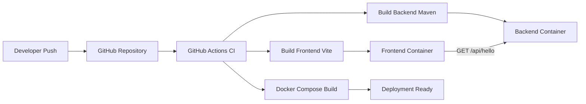

# UNIVERSITY PROJECT BOOK

## FULL STACK CI/CD APPLICATION

### (React + Spring Boot + Docker + GitHub Actions)

---

## TITLE PAGE

A Project Report Submitted in Partial Fulfillment of the Requirements for the Award of the Degree of

**[Degree Name]**

in

**[Branch / Department Name]**

by

**[Student Name 1] (Roll No: [Roll No])**  
**[Student Name 2] (Roll No: [Roll No])**

Under the Guidance of

**[Guide Name]**  
**[Designation], [Department]**

**[Department Name]**  
**[College Name]**  
**[University Name]**

**Academic Year: [20XX-20XX]**

---

## CERTIFICATE

This is to certify that the project report entitled **"Full Stack CI/CD Application"** is a bona fide work carried out by **[Student Name(s)]**, students of **[Department, Institution]**, in partial fulfillment of the requirements for the award of **[Degree Name]** during the academic year **[20XX-20XX]**, under my guidance.

**Guide Signature:** ____________________  
**Name:** [Guide Name]  
**Designation:** [Designation]

**Head of Department Signature:** ____________________  
**Name:** [HOD Name]

**Date:** ____________  
**Place:** ____________

---

## DECLARATION

We hereby declare that the project report entitled **"Full Stack CI/CD Application"** submitted to **[University/Institution Name]** is an original work carried out by us under the supervision of **[Guide Name]**. This report has not been submitted, either in part or full, to any other university or institution for the award of any degree or diploma.

**Student Signature(s):** ____________________  
**Name(s):** [Student Name(s)]  
**Date:** ____________

---

## ACKNOWLEDGMENT

We express our sincere gratitude to **[Guide Name]**, **[Designation]**, for valuable guidance, motivation, and technical support throughout the project. We thank the Head of Department and all faculty members of **[Department Name]** for providing the required facilities and encouragement.

We also acknowledge the open-source communities of React, Spring Boot, Docker, and GitHub for extensive documentation and ecosystem support that helped us complete this project successfully.

---

## ABSTRACT

This project implements a lightweight full stack web application integrated with a Continuous Integration and Continuous Deployment (CI/CD) workflow. The system uses **React with Vite** for frontend development and **Spring Boot (Java 21)** for backend API services. Both modules are containerized using **Docker**, and an automated pipeline is configured using **GitHub Actions** to build, validate, and package the complete application.

The backend exposes a REST endpoint (`/api/hello`) and the frontend consumes the API to show connection status and server response. The project demonstrates core DevOps practices such as automated build/test steps, reproducible container-based environments, and deployment readiness through **Render** service configuration.

The implementation confirms that even a small-scale project can adopt professional software delivery workflows to reduce integration errors, improve reliability, and enable faster release cycles.

**Keywords:** Full Stack, CI/CD, DevOps, React, Spring Boot, Docker, GitHub Actions, Render.

---

## TABLE OF CONTENTS

1. Introduction  
2. Literature Survey  
3. Problem Statement and Objectives  
4. Requirement Analysis and Feasibility Study  
5. System Design and Architecture  
6. Implementation Details  
7. Testing and Validation  
8. CI/CD Workflow and Deployment  
9. Results and Discussion  
10. Conclusion and Future Scope  
11. References  
12. Appendix

---

## LIST OF FIGURES

- Figure 5.1: High-Level System Architecture  
- Figure 5.2: Sequence Flow (Frontend-Backend Interaction)  
- Figure 8.1: CI Pipeline Workflow

---

## LIST OF TABLES

- Table 4.1: Functional Requirements  
- Table 4.2: Non-Functional Requirements  
- Table 7.1: Test Cases and Outcomes

---

## CHAPTER 1: INTRODUCTION

### 1.1 Background

Software delivery in many academic and small development projects remains largely manual. Manual build and deployment processes often cause environment mismatch, delayed feedback, and increased integration risk. Modern software engineering emphasizes automation, repeatability, and rapid validation to improve software quality.

### 1.2 Need for the Project

There is a need for a practical project that combines full stack development with DevOps workflow in a simple, understandable form. This project addresses that need using a React frontend, Spring Boot backend, Docker containers, and GitHub Actions CI.

### 1.3 Project Overview

The application provides a frontend user interface that communicates with a backend REST API endpoint (`/api/hello`) and displays real-time server response. The codebase is containerized and integrated into a CI workflow that runs on push and pull request events.

### 1.4 Organization of the Report

This report is organized chapter-wise covering literature, requirements, architecture, implementation, testing, CI/CD setup, and future scope.

---

## CHAPTER 2: LITERATURE SURVEY

### 2.1 Full Stack Development Frameworks

React is a component-driven JavaScript library used for building dynamic and reusable user interfaces. Spring Boot simplifies backend development through auto-configuration and production-ready features for REST APIs.

### 2.2 CI/CD Practices

Continuous Integration automates source integration and validation through build and test jobs. Continuous Delivery prepares validated artifacts for deployment and minimizes manual intervention in release workflows.

### 2.3 Containerization

Docker standardizes runtime environments by packaging application code and dependencies into containers. Multi-stage builds help reduce image size and improve portability.

### 2.4 Cloud Deployment Platforms

Render provides cloud deployment support for containerized applications with service-level configuration and environment variables. It enables direct deployment from version control repositories.

### 2.5 Research Gap

Many beginner projects demonstrate only coding aspects without end-to-end automation. This project closes that gap by integrating development, validation, containerization, and deployment readiness in one workflow.

---

## CHAPTER 3: PROBLEM STATEMENT AND OBJECTIVES

### 3.1 Problem Statement

A significant number of student projects lack standardized build automation and deployment readiness. As a result, projects become difficult to validate, replicate, and scale across environments.

### 3.2 Objectives

- Develop a full stack web application using React and Spring Boot.
- Establish frontend-backend communication through REST API.
- Containerize both services using Docker.
- Configure CI pipeline using GitHub Actions.
- Prepare deployment configuration for Render.
- Demonstrate a clean DevOps-aligned project workflow.

### 3.3 Scope

**In Scope:** Basic API interaction, UI status display, Dockerized setup, CI pipeline, deployment manifest.  
**Out of Scope:** Authentication, database layer, advanced monitoring, large-scale production hardening.

---

## CHAPTER 4: REQUIREMENT ANALYSIS AND FEASIBILITY STUDY

### 4.1 Functional Requirements (Table 4.1)

- Backend shall expose `GET /api/hello` endpoint.
- Frontend shall call backend API and display response.
- UI shall represent loading, success, and failure states.
- CI workflow shall build both backend and frontend modules.
- Docker Compose shall run frontend and backend services together.

### 4.2 Non-Functional Requirements (Table 4.2)

- Portability across local and cloud environments.
- Reproducible builds.
- Maintainable modular project structure.
- Fast integration feedback.

### 4.3 Hardware and Software Requirements

**Hardware (Minimum):**  
- 8 GB RAM  
- Dual-core CPU  
- 10 GB free disk space

**Software:**  
- Java 21  
- Maven Wrapper  
- Node.js 20+ and npm  
- Docker and Docker Compose  
- Git and GitHub account

### 4.4 Feasibility Study

- **Technical Feasibility:** High (uses mature open-source tools).
- **Operational Feasibility:** High (simple deployment and usage flow).
- **Economic Feasibility:** High (free/open-source stack, free cloud tier options).

---

## CHAPTER 5: SYSTEM DESIGN AND ARCHITECTURE

### 5.1 Architecture Description

The system consists of two core services:

- **Frontend Service:** React app built using Vite, served in production via Nginx container.
- **Backend Service:** Spring Boot API service exposing `/api/hello` endpoint.

Both services are managed through Docker Compose for local orchestration.

### 5.2 Architecture Diagram (Figure 5.1)



### 5.3 Sequence Flow (Figure 5.2)

1. User opens frontend page.
2. Frontend calls backend endpoint.
3. Backend sends response text.
4. Frontend updates UI based on response status.

---

## CHAPTER 6: IMPLEMENTATION DETAILS

### 6.1 Backend Module

- Technology: Spring Boot 3.4.1, Java 21
- Endpoint: `GET /api/hello`
- CORS configuration: wildcard origin for cross-origin access during development
- Runtime port: configurable via property `server.port=${PORT:8083}`

### 6.2 Frontend Module

- Technology: React + Vite
- API service layer uses `fetch()` with `VITE_API_URL` environment configuration
- Error-handling and loading-state management implemented in UI
- Refresh button allows manual API revalidation

### 6.3 Docker Configuration

- Backend: Multi-stage Docker build with Maven and Temurin base image.
- Frontend: Node build stage + Nginx runtime stage.
- Compose maps backend and frontend ports and defines service dependency.

### 6.4 Project Structure

- backend: Spring Boot source, tests, Dockerfile, Maven wrapper
- frontend: React source, Vite config, Dockerfile
- .github/workflows: CI pipeline definitions
- render.yaml: cloud deployment service definitions

---

## CHAPTER 7: TESTING AND VALIDATION

### 7.1 Testing Strategy

- Backend startup validation through Spring test (`contextLoads`).
- API endpoint validation using browser/Postman/curl.
- Frontend behavior validation under success and failure conditions.
- CI validation through automated pipeline execution.

### 7.2 Sample Test Cases (Table 7.1)

1. **Test Case:** Backend context load test  
   **Expected:** Application context initializes successfully  
   **Result:** Pass

2. **Test Case:** API call to `/api/hello`  
   **Expected:** Returns hello response text  
   **Result:** Pass

3. **Test Case:** Frontend API fetch when backend active  
   **Expected:** Success state displayed  
   **Result:** Pass

4. **Test Case:** Frontend API fetch when backend inactive  
   **Expected:** Error message displayed  
   **Result:** Pass

5. **Test Case:** CI pipeline run on push  
   **Expected:** Backend and frontend build without errors  
   **Result:** Pass

---

## CHAPTER 8: CI/CD WORKFLOW AND DEPLOYMENT

### 8.1 CI Pipeline Overview (Figure 8.1)

The GitHub Actions pipeline triggers on pushes to `dev` and `main`, pull requests to `main`, and manual dispatch events.

### 8.2 Pipeline Steps

1. Source checkout
2. Java setup and backend build (`mvnw clean package`)
3. Node setup and frontend dependency install (`npm ci`)
4. Frontend production build (`npm run build`)
5. Docker image build (`docker compose build`)

### 8.3 Deployment Readiness

`render.yaml` defines separate frontend and backend web services, with configurable `VITE_API_URL` for frontend API targeting.

---

## CHAPTER 9: RESULTS AND DISCUSSION

### 9.1 Results

- End-to-end communication between frontend and backend achieved.
- CI pipeline validates full build flow on repository events.
- Dockerized project runs consistently in local setup.
- Cloud deployment manifest prepared for practical hosting.

### 9.2 Discussion

The implemented workflow demonstrates that DevOps practices are feasible even for small academic projects. Automated builds and containerized environments reduce manual errors and improve reproducibility.

### 9.3 Limitations

- Limited backend business logic.
- No database integration.
- No authentication/authorization.
- Limited automated testing depth.

---

## CHAPTER 10: CONCLUSION AND FUTURE SCOPE

### 10.1 Conclusion

The project successfully implements a full stack application with an integrated CI/CD workflow. It provides a practical baseline for understanding modern software delivery pipelines using widely adopted technologies.

### 10.2 Future Scope

- Integrate relational database (PostgreSQL/MySQL).
- Add complete CRUD-based domain module.
- Implement JWT authentication and role-based access control.
- Extend unit/integration/end-to-end testing coverage.
- Add security scanning and code-quality gates.
- Introduce staging/production release pipeline with approvals.

---

## REFERENCES

1. React Documentation. https://react.dev/
2. Vite Documentation. https://vite.dev/
3. Spring Boot Documentation. https://docs.spring.io/spring-boot/
4. Apache Maven Guides. https://maven.apache.org/guides/
5. Docker Documentation. https://docs.docker.com/
6. GitHub Actions Documentation. https://docs.github.com/actions
7. Render Documentation. https://render.com/docs
8. Humble, J., Farley, D. Continuous Delivery. Addison-Wesley.
9. Forsgren, N., Humble, J., Kim, G. Accelerate. IT Revolution.

---

## APPENDIX

### Appendix A: Common Commands

```bash
# Backend build
cd backend
./mvnw clean package

# Frontend build
cd frontend
npm ci
npm run build

# Run with docker compose
docker compose up --build
```

### Appendix B: Suggested Screenshots

- Homepage displaying backend response
- Error state when backend is unavailable
- Successful GitHub Actions run page
- Docker containers running locally
- Render services dashboard

### Appendix C: Viva Preparation Questions

- Explain the difference between CI and CD.
- Why is Docker used in this project?
- What is the purpose of VITE_API_URL?
- How does GitHub Actions caching improve build time?
- What modifications are needed to make this enterprise-ready?

---

## FINAL SUBMISSION CHECKLIST

- Replace all placeholders (names, guide, institution, year).
- Add chapter page numbers in final document editor.
- Insert screenshots in relevant chapters.
- Add signature pages where required by institution.
- Export as PDF as per university format guidelines.
